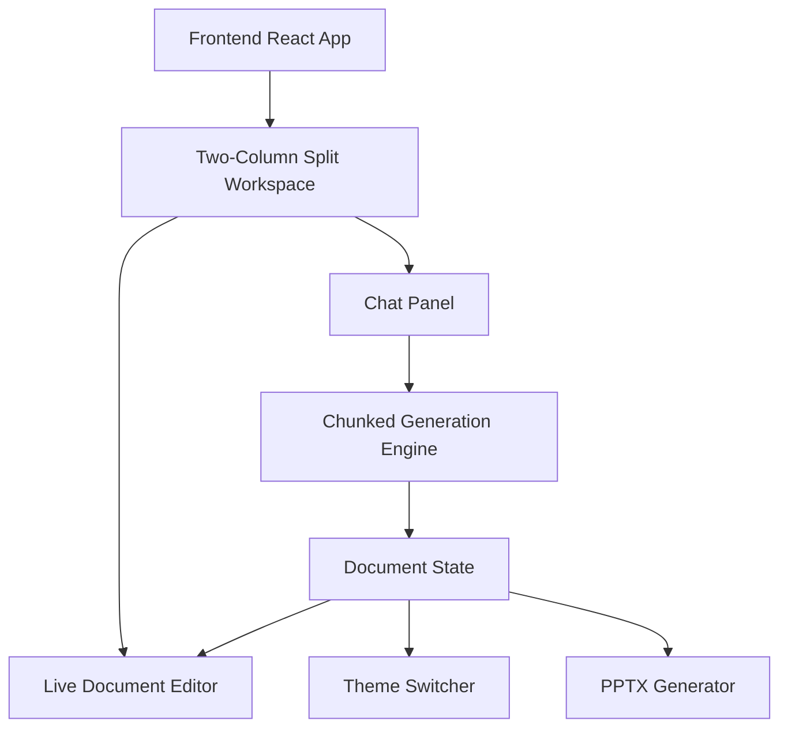

## 1. Architecture Design


## 2. Technology Description
- **Frontend Framework**: React@18 (Strict Mode)
- **Styling**: Tailwind CSS v3 (Custom themes, dark mode)
- **Build Tool**: Vite
- **Animations**: `framer-motion` (for layout animations, smooth chunk reveals, and panel resizing)
- **Document Export**: `pptxgenjs` (to generate slide outlines and fully formatted presentations natively in the browser)
- **Icons**: `lucide-react`
- **Markdown Rendering**: `react-markdown` with `remark-gfm`
- **Fonts**: `@fontsource/outfit`, `@fontsource/playfair-display`, `@fontsource/clash-display`, `@fontsource/courier-prime`

## 3. Route Definitions
| Route | Purpose |
|-------|---------|
| `/` | Main dual-pane workspace for chat, live editing, and export |

## 4. API Definitions
*Note: This application operates entirely client-side, simulating the AI backend with a deterministic chunked generation engine.*

```typescript
type DocumentChunk = {
    id: string;
    sectionTitle: string;
    content: string;
    order: number;
};

type DocumentTheme = {
    id: string;
    name: string;
    fontFamilyHeading: string;
    fontFamilyBody: string;
    bgColor: string;
    textColor: string;
};
```

## 5. Core Engine Details
### 5.1 Chunked Generation Engine
Simulates streaming an extremely long document (up to 200 pages) by yielding `DocumentChunk` objects at configurable intervals, allowing the UI to remain responsive and animate new sections smoothly without locking the main thread.

### 5.2 PPTX Exporter
Takes the array of `DocumentChunk`s, maps `sectionTitle` to Slide Titles, and splits `content` into bullet points or paragraphs. Uses `pptxgenjs` to apply the currently selected `DocumentTheme` colors and fonts to the slides.
