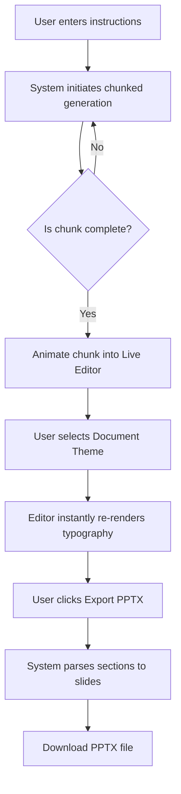

## 1. Product Overview
A sophisticated dual-pane web application designed for high-capacity, AI-driven document and presentation generation. It features a conversational interface for instructions and a live-updating editor that renders generated content in real-time, supporting up to 200 pages with chunked processing and native PowerPoint (PPTX) export capabilities.

## 2. Core Features

### 2.1 User Roles
| Role | Registration Method | Core Permissions |
|------|---------------------|------------------|
| Creator | Guest/Local session | Generate documents, switch themes, export to PPTX |

### 2.2 Feature Module
1. **Workspace Layout**: Two-column split pane (Left: Chat/Instructions, Right: Live Document Editor)
2. **Document Theming**: Dropdown selector for typography and visual styling
3. **Long-form Generation Engine**: Controls for chunked processing of massive documents (up to 200 pages)
4. **Export Engine**: One-click conversion of document sections into PPTX slide outlines and formatted slides

### 2.3 Page Details
| Page Name | Module Name | Feature description |
|-----------|-------------|---------------------|
| Workspace | Chat Panel | Input instructions, view generation progress, control chunking |
| Workspace | Live Editor | Real-time document rendering with smooth layout transitions |
| Workspace | Top Toolbar | Theme selector dropdown, PPTX export button, document outline toggle |

## 3. Core Process
The user enters instructions in the left chat panel. The system begins a chunked generation process to handle long-form content safely. As chunks complete, the right document editor animates the new content into view. The user can switch themes on the fly, instantly re-styling the document. Finally, the user can export the structured content into a fully formatted PPTX presentation.

## 4. User Interface Design
### 4.1 Design Style
- **Aesthetic Direction**: "Editorial Brutalism" - A blend of raw, structured functional panels with highly refined, magazine-quality typography in the document viewer. 
- **Colors**: 
  - Backgrounds: Stark Obsidian (`#0A0A0A`) for the UI shell, Soft Alabaster (`#F9F9F9`) for the document canvas.
  - Accents: Electric Chartreuse (`#D4FF00`) for primary actions and progress indicators.
- **Typography**: 
  - UI Elements: `Outfit` (sans-serif, geometric, crisp)
  - Document Editor (Dynamic Themes):
    - *Classic Serif*: `Playfair Display` & `Source Serif Pro`
    - *Modern Minimal*: `Clash Display` & `Satoshi`
    - *Typewriter*: `Courier Prime`
- **Animation**: Staggered reveals, smooth height interpolations for incoming text chunks, and spring-based panel resizing.
- **Layout**: Resizable split-pane architecture with heavy borders and visible grid lines.

### 4.2 Page Design Overview
| Page Name | Module Name | UI Elements |
|-----------|-------------|-------------|
| Workspace | Chat Panel | High-contrast input field, neon progress bars, minimalist message bubbles |
| Workspace | Editor Canvas | Floating page shadows, smooth scroll-into-view, elegant typography |
| Workspace | Action Bar | Pill-shaped dropdowns, hover-reveal tooltips, stark icon buttons |

### 4.3 Responsiveness
Desktop-first design optimized for ultra-wide and standard monitors. On mobile devices (< 768px), the layout stacks vertically with a tabbed interface (Chat / Document) to maximize screen real estate.
